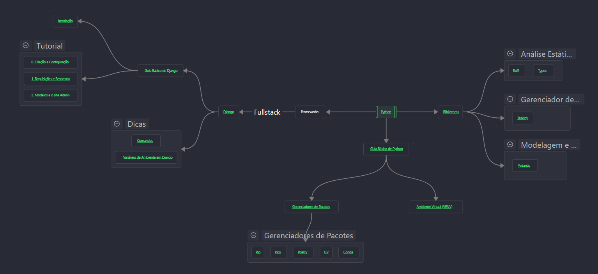

# Guia e Estudos DEV

Repositório de guias de estudo dev. Foco atual em _Python_; _TypeScript/Angular/Node_ em breve.

---

## Conteúdo

### Conceitos

- [Engenharia de Software](conceitos/engenharia-software/README.md)
- [Web](conceitos/web/web.md)
### Linguagens de Programação

- [Python](linguagens/python/README.md)
- [JavaScript / TypeScript](linguagens/javascript-typescript/README.md)

### Ferramentas

- [Git](ferramentas/git/README.md)

---

## Livros

Uma lista de livros, em maioria sobre desenvolvimento e engenharia de software [aqui](https://drive.google.com/drive/folders/1w4IV-DC5gtm2-mpbH0YSoe8Q_r8nXdr3?usp=sharing).
