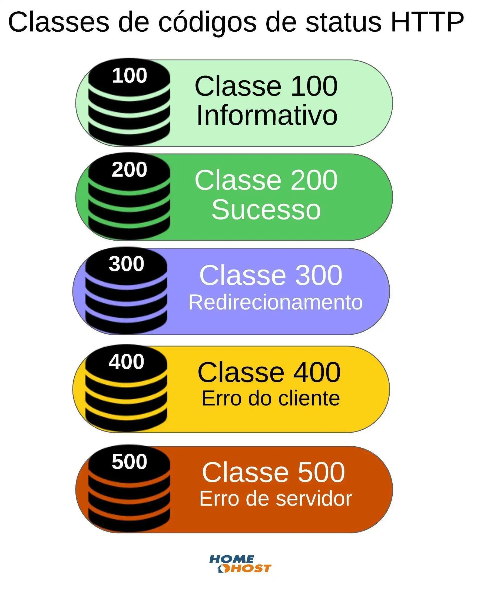

[< Web (Índice)](../web.md)
# Códigos de Status HTTP

Os códigos de status de resposta HTTP indicam se uma solicitação [HTTP](https://developer.mozilla.org/pt-BR/docs/Web/HTTP) específica foi concluída com sucesso ou não. As respostas são agrupadas em cinco classes:

1. [Informativo](#Informativo) (`100` – `199`)
2. [Sucesso](#Sucesso) (`200` – `299`)
3. [Redirecionamento](#Redirecionamento) (`300` – `399`)
4. [Erro do cliente](#Erro%20do%20cliente) (`400` – `499`)
5. [Erro do servidor](#Erro%20do%20servidor) (`500` – `599`)

Os códigos de status listados abaixo são definidos por [RFC 9110](https://httpwg.org/specs/rfc9110.html#overview.of.status.codes "Link externo (abre em uma nova aba)").

---
## Informativo

---
## Sucesso

---
## Redirecionamento

---
## Erro do cliente

---
## Erro do servidor

