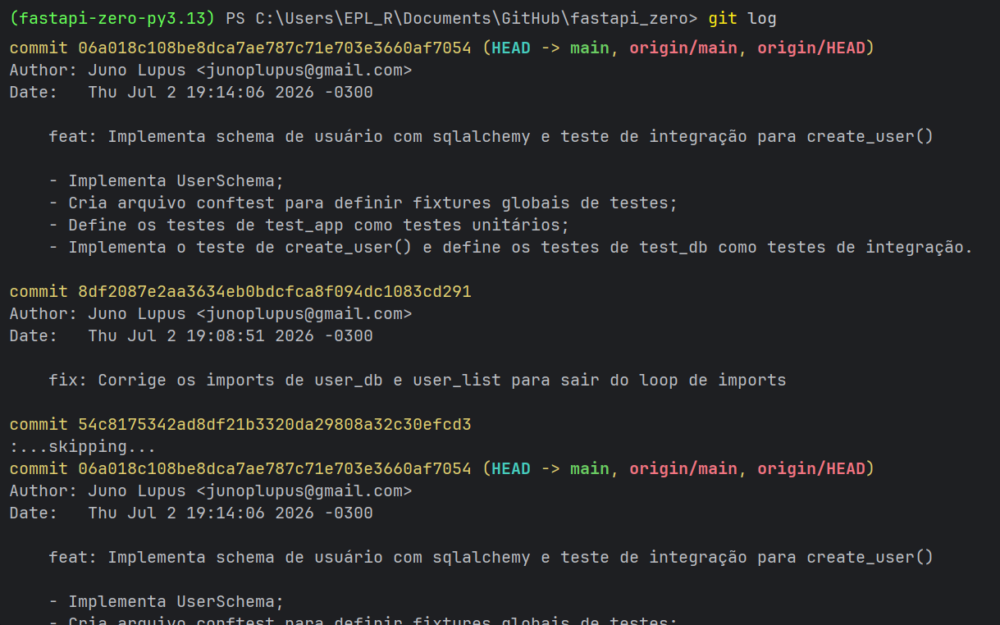

[< Guia Básico de Git (Índice)](./README.md)
# Commits

## Verificar status de arquivos novos ou modificados

``` bash
git status
```

## Adicionar arquivos para o próximo _commit_

``` bash
git add nome-do-arquivo1.ext nome-do-arquivo2.ext # adiciona arquivos específicos pra área do próximo commit.
```

``` bash
git add --all . # adiciona todos os arquivos novos, modificados e/ou deletados para a área do próximo commit.
```

``` bash
git add . # fazia quase o mesmo que o 'add --all .', exceto que ele ignora os arquivos deletados (não os remove do staging). A partir do git 2.0 faz o mesmo.
```

``` bash
git add -u # faz quase o mesmo que o 'add --all .', exceto que ele ignora os arquivos criados, colocando no stage apenas modificados ou deletados.
```

## Fazer o commit (local)

### Commits com mensagem

``` bash
git commit -m "mensagem aqui" # commita todos os arquivos que estão no stage.
```

``` bash
git commit -a -m "mensagem aqui" # commita todas as mudanças detectadas (ignorando as que estão no stage e os arquivos criados que estão fora do stage também).
```

``` bash
git commit # sem o '-m', seu editor padrão vai abrir para você escrever uma mensagem detalhada de mais de uma linha.
```

### Outras opções de commits

``` bash
git commit --alow-empty -m "Início do projeto" # cria um commit vazio (sem arquivos).
```

``` bash
git commit --no-edit # usa a mensagem do commit anterior (no editor)
```

``` bash
git commit --amend --no-edit # adiciona arquivos do stage no último commit feito, mantendo a mesma mensagem com '--no edit' ou sobreescrevendo a mensagem de antes.
```

``` bash
git reset --soft HEAD~1 # desfaz o último commit e mantêm os arquivos no stage.
```

## Ver histórico de commits

``` bash
git log # exibe todos os commits feitos.
```

``` bash
git log --oneline # exibe os commits feitos de forma resumida.
```

``` bash
git log --stat # faz quase o mesmo que 'git log', mas também exibe os arquivos envolvidos em cada commit.
```



## Referências

[https://www.w3schools.com/git/git_commit.asp](https://www.w3schools.com/git/git_commit.asp)
