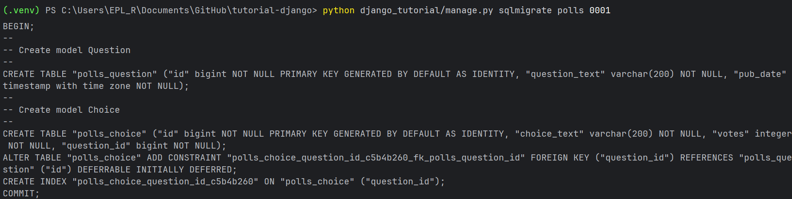

%% col-start %%
%% col-break:b:secondary %%
[< Parte 1 - Requisições e Respostas](1-requisicoes-e-respostas.md)
%% col-break:b:secondary %%
[Parte 3 - Site Admin >](3-site-admin.md)
%% col-end %%
# Modelos e o Site Admin


## Configurando o banco de dados

### settings.py

Agora, abra o `mysite/settings.py`. Ele é um módulo normal do _Python_ com variáveis de módulo representando as configurações do _Django_.

#### LANGUAGE_CODE

- Define a língua na qual os menus e as ferramentas nativas do painel administrativo do _Django_ são exibidos.

- Ajuda a formatar datas, números e moedas de acordo com o padrão cultural daquele país.

- Atua como a linguagem base para os seus próprios arquivos de tradução, caso seu projeto suporte múltiplos idiomas.

Mude a `LANGUAGE_CODE` para o desejado:

```python file:mysite/settings.py ln:132
LANGUAGE_CODE = 'pt-BR' # Configura o idioma do sistema para o Português do Brasil.
```

#### TIME_ZONE

Por padrão o _Django_ grava todos os dados de data/hora no banco de dados no formato UTC, o `TIME_ZONE` diz ao _Django_ para converter esses dados para o fuso horário local quando for exibir as informações ao usuário.

Mude o `TIME_ZONE` para o seu fuso horário:

```python file:mysite/settings.py ln:134
TIME_ZONE = 'America/Sao_Paulo' # Define o fuso horário oficial.
```

#### DATABASES

Por padrão a configuração do `DATABASES` usa o _SQLite_, ele é bem simples e ideal para quem está aprendendo sobre este _framework_. Mas em projetos reais é recomendado usar bancos de dados mais robustos como _PostgreSQL_.

```python file:mysite/settings.py ln:98
DATABASES = {  
    'default': {  
        'ENGINE': 'django.db.backends.sqlite3',  
        'NAME': BASE_DIR / 'db.sqlite3',  
    }  
}
```

Caso queira usar o _SQLite_, não precisa alterar nada nessa parte, apenas pula para a próxima seção.

##### Configurando o Django para se conectar ao Postgres

Antes de conectar o _Django_ ao _Postgres_, você precisa ter uma instância local do _Postgres_ em execução. A maneira mais fácil de fazer isso é usando o _Docker_:

```bash
$ docker run -d -p 5432:5432 --name postgres-db -e POSTGRES_PASSWORD=minha_senha -e POSTGRES_USER=meu_usuario postgres:18
```

Lembre-se de alterar o `meu_usuario` para um nome de usuário de sua preferência e `minha_senha` para uma senha de sua preferência.

Agora voltando para o arquivo `settings.py`, substitua o valor `default` pela seguinte configuração:

```python file:mysite/settings.py ln:98
DATABASES = {
    'default': {
        'ENGINE': 'django.db.backends.postgresql',
        'NAME': 'nome_do_banco',
        'USER': 'meu_usuario',
        'PASSWORD': 'minha_senha',
        'HOST': 'localhost',
        'PORT': '5432',
    }
}
```

> [!WARNING] Cuidado com dados sensíveis expostos
> Não é recomendado colocar dados sensíveis como `PASSWORD` escritas em pleno texto caso você vá subir este projeto em um repositório no git. Para proteger esses tipos de dados, é recomendado usar [variáveis de ambiente](variaveis-de-ambiente.md).

Além disso, é necessário instalar uma outra dependência para que o _Django_ saiba conversar com o Banco de Dados, a `psycopg2`. Para instalar esse pacote, vou estar utilizando o [poetry](poetry.md), mas você pode usar o [gerenciadores de pacotes](linguagens/python/basico/gerenciadores-de-pacotes/README.md) que preferir.

```bash
$ poetry add psycopg2 --group dev
```

Ou se preferir usar a versão mais recente deste pacote:

```bash
$ poetry add "psycopg[binary,pool]" --group dev # instala o pacote psycopg ^3.3.4 junto com psycopg-binary e psycopg-pool
```

Por questões de segurança, conflitos de memória e otimização, não é recomendado usar esse pacote em ambiente de produção, por isso usei `--group dev` para isolar ele no ambiente de desenvolvimento, nesse caso o grupo de dependências `dev` no _poetry_.

>[!INFO] Suporte do Django para `psycopg3`
> Ele é totalmente suportado pelo `Django 4.2` e versões mais atuais! Oferece melhor performance, suporte async nativo e API modernizada. 
> 
> Lembre-se de configurar `ENGINE: 'django.db.backends.postgresql'` dentro do `DATABASES` no `settings.py`.


#### INSTALLED_APPS

Esta lista informa ao _Django_ quais aplicativos nativos, de terceiros ou criados por você devem ser carregados no projeto. Ele ativa funcionalidades, permite a criação de tabelas no banco de dados e registra arquivos estáticos e templates.

Por padrão, o `INSTALLED_APPS` contém as seguintes aplicações, que vêm com o _Django_:

- **django.contrib.admin** - O site de administração, ativa o painel de administração visual do _Django_ (`/admin`).

- **django.contrib.auth** - Um sistema de autenticação, controla o sistema de usuários, senhas, grupos e permissões.

- **django.contrib.contenttypes** - Um _framework_ para tipos de conteúdo, permite que o _Django_ rastreie todos os modelos criados no seu projeto e crie relações genéricas entre eles.

- **django.contrib.sessions** - Um _framework_ de sessão, permite que o servidor guarde dados do usuário entre os cliques (como itens no carrinho).

- **django.contrib.messages** - Um _framework_ de envio de mensagem, exibe notificações temporárias para o usuário (ex.: "Cadastro realizado com sucesso").

- **django.contrib.staticfiles** - Um _framework_ para gerenciamento de arquivos, gerencia arquivos CSS, JavaScript e imagens.


> [!CAUTION] Cuidado ao modificar esta lista
A maioria dessas aplicações são opcionais, você pode removê-las caso realmente não precise de alguma delas, mas lembre-se de atualizar o `MIDLLEWARE` e `TEMPLATES` para evitar erros de dependência.

Quando você roda o servidor, o _Django_ não varre as pastas do projeto inteiro procurando códigos, ele lê apenas o que está explicitamente declarado nesta lista. Então sempre que você criar aplicativos no seu projeto, adicione o nome dele na lista:

```python file:mysite/settings.py ln:48 hl:49
INSTALLED_APPS = [  
	'polls.apps.PollsConfig',  # agora o Django está rastreando seu aplicativo 'polls'
    'django.contrib.admin',  
    'django.contrib.auth',  
    'django.contrib.contenttypes',
    'django.contrib.sessions',  
    'django.contrib.messages',
    'django.contrib.staticfiles'
]
```

Algumas dessas aplicações fazem uso de pelo menos uma tabela no banco de dados, então precisamos criar essas tabelas no banco de dados para poder usá-las. Para isso rode o seguinte comando:

```bash
$ python manage.py migrate
```

---
## Criando modelos

> [!TIP] Filosofia do Django
> O _Django_ segue o princípio DRY (_Don't Repeat Yourself_). O objetivo é definir os modelos em um único lugar e derivar as coisas a partir dos modelos. 
>
> Isso inclui as migrações, elas são inteiramente derivadas do seu arquivo de modelos que o _Django_ usa para atualizar o esquema de banco de dados para coincidir com seus modelos atuais.

Vamos criar dois modelos: `Question` e `Choice` que são representados por simples classes _Python_. Edite o arquivo `polls/models.py` para que fique assim:

```python file:polls/models.py
from django.db import models


class Question(models.Model):
    question_text = models.CharField(max_length=200)
    pub_date = models.DateTimeField('date published')


class Choice(models.Model):
    question = models.ForeignKey(Question, on_delete=models.CASCADE)
    choice_text = models.CharField(max_length=200)
    votes = models.IntegerField(default=0)
```

Aqui, cada modelo é representado por uma classe derivada da classe [`django.db.models.Model`](https://docs.djangoproject.com/pt-br/5.2/ref/models/instances/#django.db.models.Model "django.db.models.Model"). Cada modelo possui alguns atributos de classe, as quais por sua vez representa um campo/coluna do banco de dados no modelo.

Cada campo é representado por uma instância de uma classe [`Field`](https://docs.djangoproject.com/pt-br/5.2/ref/models/fields/#django.db.models.Field "django.db.models.Field") – por exemplo, [`CharField`](https://docs.djangoproject.com/pt-br/5.2/ref/models/fields/#django.db.models.CharField "django.db.models.CharField") para campos do tipo caractere e [`DateTimeField`](https://docs.djangoproject.com/pt-br/5.2/ref/models/fields/#django.db.models.DateTimeField "django.db.models.DateTimeField") para data/hora. Isto diz ao _Django_ qual tipo de dado cada campo contém.

Por padrão o _Django_ usa o nome da própria variável como nome da coluna, mas você pode usar um argumento opcional na primeira posição de um [`Field`](https://docs.djangoproject.com/pt-br/5.2/ref/models/fields/#django.db.models.Field "django.db.models.Field") para definir um nome legível para seres humanos, o qual será usado em uma série de partes introspectivas do _Django_ e servirá também como documentação. Fizemos isso com `pub_date` dentro de `Question`.

Algumas classes de [`Field`](https://docs.djangoproject.com/pt-br/5.2/ref/models/fields/#django.db.models.Field "django.db.models.Field") possuem elementos obrigatórios. O [`CharField`](https://docs.djangoproject.com/pt-br/5.2/ref/models/fields/#django.db.models.CharField "django.db.models.CharField"), por exemplo, requer que você informe a ele um `max_length` que é usado não apenas no esquema do banco de dados, mas na validação, como nós veremos em breve.

Um [`Field`](https://docs.djangoproject.com/pt-br/5.2/ref/models/fields/#django.db.models.Field "django.db.models.Field") pode ter vários argumentos opcionais; neste caso, definimos o valor [`default`](https://docs.djangoproject.com/pt-br/5.2/ref/models/fields/#django.db.models.Field.default "django.db.models.Field.default") de `votes` para `0`.

Finalmente, note que uma relação foi criada, usando [`ForeignKey`](https://docs.djangoproject.com/pt-br/5.2/ref/models/fields/#django.db.models.ForeignKey "django.db.models.ForeignKey"). Isso diz ao _Django_ que cada `Choice` está relacionada a uma única `Question`. O _Django_ oferece suporte para todos os relacionamentos comuns de um banco de dados: muitos-para-um, muitos-para-muitos e um-para-um.

---
## Ativando modelos

Com os modelos criados, o _Django_ é capaz de:

- Criar um esquema de banco de dados (instruções `CREATE TABLE`) para a aplicação.
    
- Criar uma API de acesso a banco de dados para acessar objetos `Question` e `Choice`.

> [!WARNING] Não se esqueça
> Você precisa adicionar o `polls` no `INSTALLED_APPS` do  `settings.py` antes de prosseguir com o tutorial como foi explicado anteriormente em [INSTALLEDAPPS](#INSTALLEDAPPS).

Para avisar o _Django_ que você fez alterações nos seus modelos (`polls/models.py`), é necessário executar este comando:

```bash
$ python manage.py makemigrations polls
```

Você deverá ver algo tipo:

```bash
Migrations for 'polls':
  polls/migrations/0001_initial.py
    + Create model Question
    + Create model Choice
```

As [migrações](../dicas/migracoes.md) são como o _Django_ armazena e rastreia as alterações nos seus modelos (e, portanto, seu esquema de banco de dados), são arquivos de código que atuam como um sistema de controle de versão para o seu banco de dados.

Os arquivos foram criados, mas ainda não foram executados de fato, portanto, não houve nenhuma alteração no seu banco de dados. Caso você queira ver qual _SQL_ a migração  `0001_initial.py` vai rodar, é necessário usar o comando [`sqlmigrate`](https://docs.djangoproject.com/pt-br/5.2/ref/django-admin/#django-admin-sqlmigrate) :

```bash
$ python manage.py sqlmigrate polls 0001
```



> [!NOTE] Note o seguinte:
> 
> - A saída vai variar dependendo do banco de dados que você está utilizando.
> <br>
> - Os nomes das tabelas são gerados automaticamente combinando o nome da aplicação (`polls`) e o nome em minúsculo do modelo, `question` e `choice` (você pode alterar esse comportamento).
> <br>
> - Chaves primárias(_IDs_) são adicionadas automaticamente (você pode alterar isso).
> <br>
> - Por padrão, o _Django_ adiciona `_id` ao nome do campo de uma chave estrangeira (você também pode alterar isso).
> <br>
> - O _Django_ lida automaticamente com campos específicos do banco de dados utilizado como `auto_increment(MySQL`, `bigint PRIMARY KEY GENERATED BY DEFAULT AS IDENTITY(PostgreSQL)` ou `integer primary key autoincrement(SQLite)`. Ele também lida com aspas, usando aspas duplas `""` ou `''` quando necessário.
> <br>
> - O comando `sqlmigrate` não executa a migração no seu banco de dados, ele apenas exibe na tela para que você veja qual _SQL_ o _Django_ entendeu ser necessário. É útil quando você quer saber o que o _Django_ vai executar ou se os administradores do seu banco de dados exigem scripts _SQL_ para realizar alterações.

Se você tiver interesse, você pode rodar `python manage.py check` para checar por problemas no seu projeto sem criar novas _migrations_ ou tocar no seu banco de dados.

Agora rode o comando `migrate` novamente para criar essas tabelas dos modelos `polls_question` e `polls_choice` no seu banco de dados:

```bash
$ python manage.py migrate
# Operations to perform:
#   Apply all migrations: admin, auth, contenttypes, polls, sessions
# Running migrations:
#  Rendering model states... DONE
#  Applying polls.0001_initial... OK
```

O comando `migrate` pega todas as migrações que ainda não foram aplicadas (_Django_ rastreia quais foram aplicadas usando uma tabela especial em seu banco de dados chamada `django_migrations`) e aplica elas no seu banco de dados, sincronizando as alterações feitas aos seus modelos com o esquema no banco de dados. 

> [!WARNING] Lembre-se desses 3 passos
> Sempre que fizer alterações nos seus modelos:
> 1. Mude seus modelos (em `models.py`)
> <br>
> 2. Rode `python manage.py makemigrations` para criar migrações para suas modificações.
> <br>
> 3. Rode `python manage.py migrate` para aplicar suas modificações no banco de dados.

Caso queira saber mais sobre as migrações (_migrations_) no _Django_, clique [aqui](../dicas/migracoes.md).

---
## Brincando com a API

Vamos dar uma olhada no shell interativo do _Python_ e brincar um pouco com a nossa API:

```bash
$ python manage.py shell
```

Usamos `manage.py` ao invés de simplesmente digitar `python`, porquê o `manage.py` define a variável de ambiente [`DJANGO_SETTINGS_MODULE`](https://docs.djangoproject.com/pt-br/5.2/topics/settings/#envvar-DJANGO_SETTINGS_MODULE) que dá ao _Django_ o caminho para o seu arquivo `mysite/settings.py`. Por padrão, o comando [`shell`](https://docs.djangoproject.com/pt-br/5.2/ref/django-admin/#django-admin-shell) automaticamente importa os modelos do seu [`INSTALLEDAPPS`](#INSTALLEDAPPS).

Por enquanto não temos nenhuma `Question`.

```python
>>> Question.objects.all()
# <QuerySet []>
```

Vamos criar uma nova `Question`, mas antes vamos precisar importar o pacote `timezone`. O suporte para _timezones_ está habilitada por padrão no arquivo [`settings.py`](#settings.py), então o _Django_ espera um _datetime_ com _tzinfo_ para `pub_date`. Para isso, use `timezone.now()` ao invés de `datetime.datetime.now()`.

```python
>>> from django.utils import timezone
>>> q = Question(question_text="What's new?", pub_date=timezone.now())
```

Para salvar o objeto dentro do banco de dados, você precisa chamar `save()` explicitamente:

```python
>>> q.save()
```

Agora temos um objeto `Question` no banco de dados:

```python
>>> q.id
# 1
>>> q.question_text
# "What's new?"
>>> q.pub_date
# datetime.datetime(2026, 7, 9, 19, 18, 23, 913394, tzinfo=datetime.timezone.utc)
```

Vamos alterar o valor de um dos atributos e chamar `save()`:

```python
>>> q.question_text = "What's up?"
>>> q.save()
>>> Question.objects.all()
# <QuerySet [<Question: Question object (1)>]>
```

Espere um pouco. `<Question: Question object (1)>` é uma representação totalmente inútil desse objeto! Vamos corrigir isso editando o modelo da `Question` (`polls/models.py`) e adicionando um método `__str__()` a ambos os modelos.

```python file:pools/models.py hl:6-7,12-13
from django.db import models


class Question(models.Model):
    # ...
    def __str__(self):
        return self.question_text


class Choice(models.Model):
    # ...
    def __str__(self):
        return self.choice_text
```

> [!TIP] Recomendação
> É importante adicionar métodos `__str__()` aos seus modelos, não apenas para sua própria conveniência quando estiver lidando com o prompt interativo, mas também porque representações de objetos são usadas por toda interface administrativa gerada automaticamente pelo _Django_.

Vamos também adicionar um método personalizado a este modelo:

```python title:polls/models.py hl:1,4,9-10
import datetime

from django.db import models
from django.utils import timezone


class Question(models.Model):
    # ...
    def was_published_recently(self):
	    return self.pub_date >= timezone.now() - datetime.timedelta(days=1)
        return self.pub_date >= timezone.now() - datetime.timedelta(days=1)
```

> [!TIP] Gerenciamento de fuso horário
> Se você não é familiar com o gerenciamento de fuso horário no _Python_, você pode aprender mais na [documentação de suporte a fuso horários](https://docs.djangoproject.com/pt-br/5.2/topics/i18n/timezones/).

Salve essas alterações e inicie um novo _shell_ interativo do _Python_ (`>>>`). Primeiro use o comando `exit()` e depois rode novamente o comando `python manage.py shell` para recarregar os modelos.

```python
>>> Question.objects.all()
# <QuerySet [<Question: What's up?>]>
```

O _Django_ oferece uma API robusta de consulta a banco de dados que é totalmente baseada em parâmetros com palavras-chave (`kwargs`).

```python
>>> Question.objects.filter(id=1)
# <QuerySet [<Question: What's up?>]>
>>> Question.objects.filter(question_text__startswith="What")
# <QuerySet [<Question: What's up?>]>
```

Vamos pegar a `question` que foi publicada nesse ano:

```python parse:bash
>>> from django.utils import timezone
>>> current_year = timezone.now().year
>>> Question.objects.get(pub_date__year=current_year)
# <Question: What's up?>
```

Agora vamos tentar usar um ID que não existe, isso vai gerar uma `exception`:

```bash error:2-4
>>> Question.objects.get(id=2)
Traceback (most recent call last):
...
DoesNotExist: Question matching query does not exist.
```

O _Django_ oferece um atalho para consultas por chaves primárias.

```python
>>> Question.objects.get(pk=1)
# <Question: What's up?>
>>> q = Question.objects.get(pk=1)
>>> q.was_published_recently()
# True
```

Vamos criar algumas `Choice` para nossa `Question`. O _Django_ cria um [set](../../../basico/listas-sets-tuplas.md#Sets) (definido como `choice_set`) para guardar o "outro lado" da relação com a chave estrangeira (_ForeignKey_, nesse caso as `choice` de uma `question`) que pode ser acessada via API do _Django_. Vamos exibir todas as `choices` vinculadas a `question` de id/pk `1`: 

```python
>>> q.choice_set.all()
### <QuerySet []>
```

Vamos criar 3 `choice` vinculadas à esta `question`:

```python
>>> q.choice_set.create(choice_text="Not much", votes=0)
# <Choice: Not much>
>>> q.choice_set.create(choice_text="The sky", votes=0)
# <Choice: The sky>
>>> c = q.choice_set.create(choice_text="Just hacking again", votes=0)
```

Através da API do _Django_, os objetos `Choice` têm acesso aos objetos `Question` à qual estão vinculados através da chave estrangeira.

```python
>>> c.question
# <Question: What's up?>
```

E vise-versa: os objetos `Question` têm acesso aos objetos `Choice` vinculados.

```python
>>> q.choice_set.all()
# <QuerySet [<Choice: Not much>, <Choice: The sky>, <Choice: Just hacking again>]>
>>> q.choice_set.count()
# 3
```

A API do _Django_ segue as relações entre entidades automaticamente. Use `__` para separar relacionamentos. Isso funciona em vários níveis, o quanto você precisar, não têm um limite.

Agora vamos encontrar todas as `Choice` de qualquer `Question` que foram publicadas esse ano (reutilizando a variável `current_year` que criamos anteriormente).

```python
>>> Choice.objects.filter(question__pub_date__year=current_year)
# <QuerySet [<Choice: Not much>, <Choice: The sky>, <Choice: Just hacking again>]>
```

Vamos deletar uma das `Choice`. Use o método `delete()` para isso.

```python
>>> c = q.choice_set.filter(choice_text__startswith="Just hacking")
>>> c.delete()
```

Para mais informações sobre relacionamento de modelos, veja [Acessando objetos relacionados](https://docs.djangoproject.com/pt-br/5.2/ref/models/relations/). Para mais informação em como usar sublinhados duplos para pesquisa usando campos da _API_, veja [Pesquisa com campos](https://docs.djangoproject.com/pt-br/5.2/topics/db/queries/#field-lookups-intro). Para um detalhamento completo da _API_ de banco de dados, veja sobre [referência à API de Banco de Dados](https://docs.djangoproject.com/pt-br/5.2/topics/db/queries/).


%% col-start %%
%% col-break:b:secondary %%
[< Parte 1 - Requisições e Respostas](1-requisicoes-e-respostas.md)
%% col-break:b:secondary %%
[Parte 3 - Site Admin >](3-site-admin.md)
%% col-end %%
