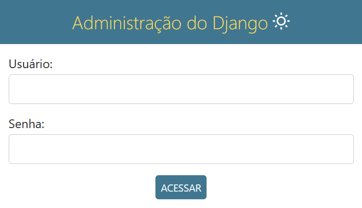
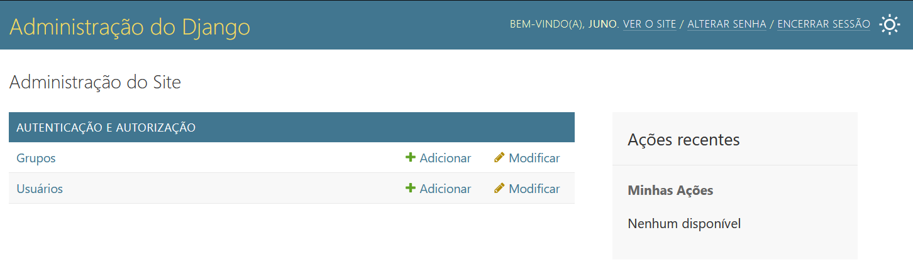
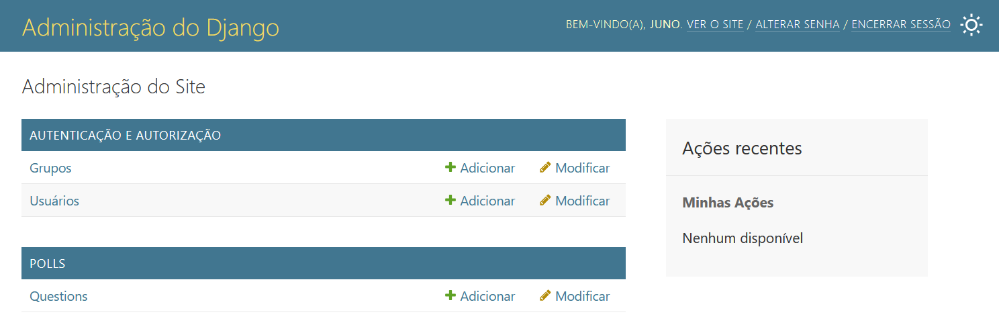
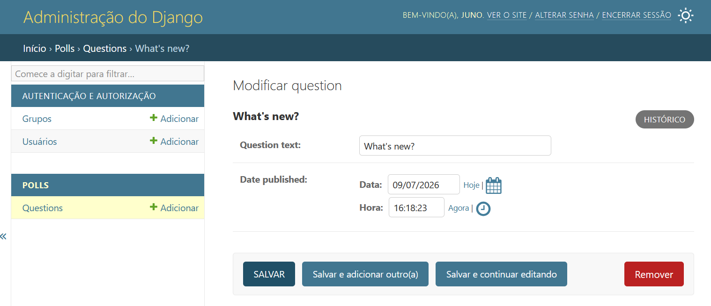
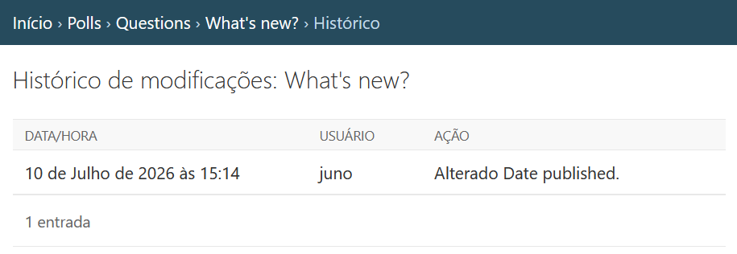

%% col-start %%
%% col-break:b:secondary %%
[< Parte 2 - Banco de dados e Modelos](2-db-e-modelos.md)
%% col-break:b:secondary %%
[Parte 4 - Views e Templates >](4-views-e-templates.md)
%% col-end %%
# Site Admin

> [!TIP] O _Django_ soluciona o problema de criar uma interface unificada para os administradores editarem o conteúdo. A interface de administração não foi desenvolvida necessariamente para ser usada pelos visitantes do site, mas sim pelos gerentes.

## Criando um usuário administrador

Primeiro temos que criar um superusuário que possa acessar o site de administração, executando o seguinte comando:

```bash
$ python manage.py createsuperuser
```

Digite seu nome de usuário desejado e pressione enter.

```bash
Username: admin
```

Em seguida, será requisitado seu endereço de e-mail desejado:

```bash
Email address: admin@example.com
```

O último passo é digitar sua senha. Você será solicitado que digite sua senha duas vezes, a segunda vez como uma confirmação da primeira.

```bash
Password: **********
Password (again): *********
Superuser created successfully.
```


---
## Inicie o servidor de desenvolvimento

O site de administração vem ativado por padrão. Vamos iniciar o servidor de desenvolvimento e explorá-lo.

> [!TIP] Executar o servidor
> Se o servidor não estiver sendo executado, inicie-o com o seguinte comando:
> ```python
> $ python manage.py runserver
> ```
> E caso esteja congelado na verificação de erros e não exibir no terminal a url, verifique se o seu banco de dados está rodando.

Agora, vá no navegador e acesse o domínio da sua aplicação com `/admin/`, ex.: [http://127.0.0.1:8000/admin/](http://127.0.0.1:8000/admin/). Você verá a tela de login de admin:



> O site de administração usa a linguagem que foi definida  no [LANGUAGE_CODE](2-db-e-modelos.md#LANGUAGE_CODE), no meu caso, português do Brasil.

---
## Entre no site de administração

Agora, use os dados do superusuário que você criou [antes](#Criando%20um%20usuário%20administrador) e você verá esta tela:



Você deverá ver alguns outros tipos de conteúdos editáveis, incluindo grupos e usuários. Estas funcionalidades são fornecidas pelo `django.contrib.auth`, o _framework_ de autenticação fornecido pelo _Django_.

---
## Torne a aplicação de enquetes editável no site no site de administração

Mas onde está nossa aplicação de enquete? Ela não está visível na página principal do site de administração.

Vamos precisar fazer mais uma coisa: dizer para o `admin` que objetos `Question` devem possuir uma interface _admin_. Para fazer isso, abra o arquivo `polls/admin.py`, e edite para ficar assim:

```python file:polls/admin.py
from django.contrib import admin

from .models import Question

admin.site.register(Question)
```

---
## Explore a funcionalidade de administração

Agora que nós registramos `Question`, o _Django_ sabe que ela deve ser exibida na página principal do site de administração:



Clique em [`Questions`](http://127.0.0.1:8000/admin/polls/question/). Esta página mostra todas as `questions` do seu banco de dados e deixa você escolher uma para alterar. Lá está a `What's new?` que criamos anteriormente.


Clique na enquete `What's up?` para editá-la:



> [!NOTE] Coisas para observar aqui
> - O formulário é gerado automaticamente para o modelo `Question`.
> <br>
> - Os diferentes tipos de campos ([`DateTimeField`](https://docs.djangoproject.com/pt-br/5.2/ref/models/fields/#django.db.models.DateTimeField "django.db.models.DateTimeField"), [`CharField`](https://docs.djangoproject.com/pt-br/5.2/ref/models/fields/#django.db.models.CharField "django.db.models.CharField")) correspondem aos respectivos componentes HTML de inserção. Cada tipo de campo sabe como se exibir no site de administração do _Django_.
> <br>
> - Cada [`DateTimeField`](https://docs.djangoproject.com/pt-br/5.2/ref/models/fields/#django.db.models.DateTimeField "django.db.models.DateTimeField") ganha um atalho JavaScript de graça. Datas possuem um atalho “Hoje” e um calendário popup, e horas têm um atalho “Agora” e um conveniente popup com listas de horas utilizadas comumente.
> <br>
> A parte inferior da página fornece uma série de opções:
> <br>
> - **Salvar** - Salva as alterações e retorna para a página de listagem de `Question`.
> <br>
> - **Salvar e continuar editando** - Salva as alterações e recarrega esta página de edição deste objeto.
> <br>
> - **Salvar e adicionar outro** - Salva as alterações e abre um novo formulário em branco para este tipo de objeto (`Question`).
> <br>
> - **Deletar** - Exibe uma página de confirmação de exclusão.

> [!TIP] Possível horário errado em `Date published`
> Se o valor do `Date published` não bate com hora que a questão foi criada na [Parte 2 - Banco de dados e Modelos](2-db-e-modelos.md), provavelmente quer dizer que foi esquecido de configurar o correto valor da configuração do [`TIME_ZONE`](https://docs.djangoproject.com/pt-br/5.2/ref/settings/#std-setting-TIME_ZONE). Altere isso, e recarregue a página e verifique se o calor correto aparece. 

Altere a “**Data de publicação**” clicando nos atalhos “**Hoje**” e “**Agora**”. Em seguida, clique em “**Salvar e continuar editando**” Então clique em “**Histórico**” no canto superior direito. Você verá uma página exibindo todas as alterações feitas neste objeto pelo site de administração do _Django_, com a hora e o nome de usuário da pessoa que fez a alteração e o que foi alterado:



Na próxima parte deste tutorial vamos aprender como adicionar mais `views` para nossa aplicação `polls`.


%% col-start %%
%% col-break:b:secondary %%
[< Parte 2 - Banco de dados e Modelos](2-db-e-modelos.md)
%% col-break:b:secondary %%
[Parte 4 - Views e Templates >](4-views-e-templates.md)
%% col-end %%
