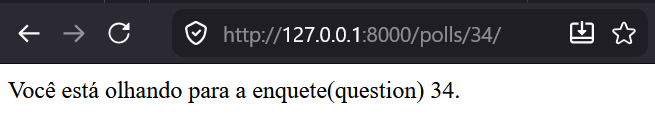
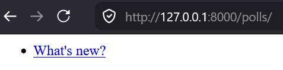

%% col-start %%
%% col-break:b:secondary %%
[< Parte 3 - Site Admin](3-site-admin.md)
%% col-break:b:secondary %%
[Parte 5 - Forms e Views genéricas >](5-forms-e-views-genericas.md)
%% col-end %%
# Views e Templates


Uma **View** em uma aplicação _Django_ geralmente têm uma função específica e um **template** específico. 

>[!TIP] Por padrão as **views** no _Django_ lidam diretamente com requisições do tipo _GET_, isso é algo que você pode alterar em cada **view**, vamos explorar um pouco sobre o método _POST_ na próxima parte, mas não é o foco deste tutorial.

Em nossa aplicação de enquetes (`polls`), nós teremos as seguintes **views**:

- **Página de "índice" de enquetes** - exibe as perguntas (`Question`) das enquetes mais recentes.

- **Página de "detalhes" da enquete** - exibe a pergunta (`question_text`) de uma enquete específica, sem os resultados, mas com um formulário para votar.

- **Página de “resultados” de perguntas** - exibe os resultados da pergunta (`Question`) de uma enquete específica.

- **Ação de voto** - gerencia a votação para uma escolha (`Choice`) sobre a pergunta (`Question`) de uma enquete específica.

Em _Django_, páginas web e outros conteúdos são entregues por **views**. Cada **view** é representada por uma função _Python_ (ou método, no caso de **views** baseadas em classes). O _Django_ vai escolher uma **view** através da _URL_ da requisição (especificamente a parte da _URL_ após o nome do domínio, ex.: `/pools/`).

Para encontrar uma **view** através da _URL_, o _Django_ usa o que conhecemos como "_URLconfs_". Uma _URLconf_ mapeia as _URLs_ até as **views**.

> [!TIP] Este tutorial oferece apenas instruções básicas sobre o uso de URLconfs, se quiser ver mais informações clique [aqui](https://docs.djangoproject.com/pt-br/5.2/topics/http/urls/).

---
## Escrevendo mais views

Agora vamos adicionar mais algumas **views** em `polls/views.py`. Estas **views** são um pouco diferentes, porque elas recebem um argumento (`question_id`):

```python file:polls/views.py ln:8
def detail(request, question_id) -> HttpResponse:  
    return HttpResponse('Você está olhando para a enquete(question) %s.' % question_id)  
  
  
def results(request, question_id) -> HttpResponse:  
    response = 'Você está olhando para os resultados de enquete(question) %s.'  
    return HttpResponse(response % question_id)  
  
  
def vote(request, question_id) -> HttpResponse:  
    return HttpResponse('Você está votando para a enquete(question) %s.' % question_id)
```

Mapeie as novas **views** dentro de `polls.urls` usando o método `path()`:

```python file:polls/urls.py hl:9,11,13
from django.urls import path  
  
from polls import views  
  
urlpatterns = [  
    # GET /polls/  
    path('', views.index, name='index'),  
    # GET /polls/{id}/  
    path('<int:question_id>/', views.detail, name='detail'),  
    # GET /polls/{id}/results/  
    path('<int:question_id>/results/', views.results, name='results'),  
    # GET /polls/{id}/vote/  
    path('<int:question_id>/vote/', views.vote, name='vote'),  
]
```

Faça alguns testes no seu navegador. Tente usar a URL [`/polls/34`](http://127.0.0.1:8000/polls/34/), vai executar a função `detail()` e exibir qualquer ID que você tenha passado na URL. 



Agora tente a URL [`/polls/34/results/`](http://127.0.0.1:8000/polls/34/results/) e a [`/polls/34/vote/`](http://127.0.0.1:8000/polls/34/vote/) também - elas irão exibir as páginas de resultados (`results()`) e de votação (`vote()`).

> [!INFO] Requisições em Django
> Quando alguém requisita uma página do seu site web, por exemplo `/polls/34/`, o _Django_ vai carregar o módulo _Python_ `mysite.urls` que é pra onde a [`ROOT_URLCONF`](https://docs.djangoproject.com/pt-br/5.2/ref/settings/#std-setting-ROOT_URLCONF) dentro de `settings.py` está apontando.
> <br>
> ```python file:mysite/settings.py ln:81
> ROOT_URLCONF = 'mysite.urls'
> ```
> 
> Ele percorre a variável `urlpatterns` até encontrar a URL compatível `polls/` e envia o texto passado `34/` como parâmetro para a _URLconf_ `polls.urls` para ser processado posteriormente pela função `detail()`:
> <br>
> ```python
> detail(request=<HttpRequest object>, question_id=34)
> ```
> 
> A parte `question_id=34` vem de `<int:question_id>`. O uso de colchetes angulares(`<>`) “captura” parte da _URL_ e a envia como um argumento de palavra-chave para a função de **view**. A parte `question_id` da string define o nome que será usado para identificar o padrão correspondente, e a parte `int` é um conversor que determina quais padrões devem corresponder a essa parte do caminho da _URL_. Os dois pontos (`:`) separam o conversor e o nome do padrão.

---
## Escreva views que façam algo

Cada **view** é responsável por fazer uma dessas duas coisas: devolver um objeto [`HttpResponse`](https://docs.djangoproject.com/pt-br/5.2/ref/request-response/#django.http.HttpResponse "django.http.HttpResponse") contendo o conteúdo para a página requisitada, ou levantar uma exceção como [`Http404`](https://docs.djangoproject.com/pt-br/5.2/topics/http/views/#django.http.Http404 "django.http.Http404"). O resto é com você.

Sua **view** pode ler registros do banco de dados, ou não. Ela pode usar um sistema de **templates** como o do _Django_ - ou outro sistema de **templates** _Python_ de terceiros - ou não. Ele pode gerar um arquivo PDF, saída em um XML, criar um arquivo ZIP sob demanda, qualquer coisa que você quiser, usando qualquer biblioteca _Python_ você quiser.

Tudo que o _Django_ espera é que a **view** devolva um [`HttpResponse`](https://docs.djangoproject.com/pt-br/5.2/ref/request-response/#django.http.HttpResponse "django.http.HttpResponse"). Ou uma exceção.

Por ser conveniente, vamos usar a própria API de banco de dados do _Django_, a qual falamos na [Parte 2 - Banco de dados e Modelos](2-db-e-modelos.md). Vamos tentar exibir as últimas 5 `poll questions` do sistema na **view** `index()`, separada por vírgulas, de acordo com sua data de publicação:

```python file:polls/views.py
from django.http import HttpResponse

from .models import Question


def index(request) -> HttpResponse:  
    latest_question_list = Question.objects.order_by('-pub_date')[:5]  
    output = ', '.join(  
        [question.question_text for question in latest_question_list]  
    )  
    return HttpResponse(output)

# Não precisa alterar nada nas outras views por enquanto.
```

Há um problema aqui, no entanto: o design da página esta codificado na **view**. Se você quiser mudar a forma de apresentação de sua página, você terá de editar este código diretamente em _Python_. Então vamos usar o sistema de **templates** do _Django_ para separar o design do código _Python_:

Primeiro, crie um diretório chamado `templates` em seu diretório `polls`. O _Django_ irá procurar **templates** lá.

A sua configuração de projeto [`TEMPLATES`](https://docs.djangoproject.com/pt-br/5.2/ref/settings/#std-setting-TEMPLATES) descreve como o _Django_ vai carregar e renderizar **templates**. O arquivo de configuração padrão usa o backend `DjangoTemplates` do qual a opção [`APP_DIRS`](https://docs.djangoproject.com/pt-br/5.2/ref/settings/#std-setting-TEMPLATES-APP_DIRS) é configurada como `True`. Por convenção `DjangoTemplates` procura por um subdiretório “**templates**” em cada uma das [`INSTALLED_APPS`](https://docs.djangoproject.com/pt-br/5.2/ref/settings/#std-setting-INSTALLED_APPS).

Dentro do diretório `templates` que você acabou de criar, crie outro diretório chamado `polls`, e dentro dele crie um arquivo chamado `index.html`. Em outras palavras, seu **template** deve estar em `polls/templates/polls/index.html`. Por causa de como o carregador de template `app_directories` funciona conforme descrito acima, você pode se referir a este **template** dentro do _Django_ como `polls/index.html`.

> [!INFO] Namespacing de template
> Poderíamos colocar nossos templates diretamente em `polls/templates` (ao invés de criar outro subdiretório `polls` dentro de `templates`), mas seria uma má ideia.
> <br>
> O _Django_ vai escolher o primeiro **template** com um nome correspondente, por exemplo `index`, se você tivesse um **template** com esse mesmo nome em uma aplicação diferente, o _Django_ não conseguiria distinguir entre eles.
> <br>
> A melhor forma de garantir que o _Django_ aponte para o caminho certo é usando _namespacing_ neles. Ou seja, colocando esses **templates** dentro de outro diretório nomeado para o próprio aplicativo (`polls.index`).

Ponha o seguinte código neste **template**:

```html file:polls/templates/polls/index.html

    <ul>
    
        <li>
	        <a href="/polls/{{ question.id }}/">{{ question.question_text }}</a>
		</li>
    
    </ul>

    <p>No polls are available.</p>

```

> [!NOTE] Nota
> Para tornar o tutorial mais curto, todos os exemplos de modelo usam HTML incompleto. Em seus próprios projetos você deve usar documentos HTML completos.

Agora vamos atualizar nossa **view** em **polls/views.py** para usar o **template**:

```python file:polls/views.py hl:2,9-11
from django.http import HttpResponse
from django.template import loader

from .models import Question


def index(request) -> HttpResponse:
    latest_question_list = Question.objects.order_by('-pub_date')[:5]
    template = loader.get_template('polls/index.html')
    context = {'latest_question_list': latest_question_list}
    return HttpResponse(template.render(context, request))
    
# ...
```

Esse código carrega o **template** chamado `polls/index.html` e passa um contexto para ele. Nesse caso, o contexto é um dicionário mapeando nomes de variáveis para objetos _Python_.

Acesse `/polls/` no seu navegador e você deve ver uma lista contendo a `question` "What's new?" da [Parte 2 - Banco de dados e Modelos](2-db-e-modelos.md). O link `<li>` aponta para a página de detalhes das perguntas (`/polls/{id}/`).



---
## Um atalho: [`render()`](https://docs.djangoproject.com/pt-br/5.2/topics/http/shortcuts/#django.shortcuts.render)

É uma prática muito comum carregar um **template**, preenchê-lo com um contexto e retornar um objeto [`HttpResponse`](https://docs.djangoproject.com/pt-br/5.2/ref/request-response/#django.http.HttpResponse "django.http.HttpResponse") com o resultado do **template** renderizado. O _Django_ fornece um atalho para isso. Aqui está toda a **view** `index()` reescrita:

```python file:polls/views.py ln:2 hl:2,9-10
from django.shortcuts import render

from .models import Question


def index(request) -> HttpResponse:
    latest_question_list = Question.objects.order_by('-pub_date')[:5]
    context = {'latest_question_list': latest_question_list}
    return render(request, 'polls/index.html', context)
```

Note que uma vez que você tiver feito isto em todas as **views**, não vamos mais precisar importar [loader](https://docs.djangoproject.com/pt-br/5.2/topics/templates/#module-django.template.loader).

A função [`render()`](https://docs.djangoproject.com/pt-br/5.2/topics/http/shortcuts/#django.shortcuts.render "django.shortcuts.render") recebe o nome do **template** como primeiro argumento e um dicionário opcional como segundo argumento. Ele retorna um objeto [`HttpResponse`](https://docs.djangoproject.com/pt-br/5.2/ref/request-response/#django.http.HttpResponse "django.http.HttpResponse") do **template** informado renderizado com o contexto determinado.

---
## Lançando um erro 404

Agora vamos alterar a **view** de detalhe de pergunta(`question`) - a página que mostra as questões para uma enquete lançada. Aqui está a **view**:

```python file:polls/views.py
from django.http import HttpResponse, Http404
from django.shortcuts import render

from .models import Question


# ...
def detail(request, question_id: int) -> HttpResponse:  
    try:  
        question = Question.objects.get(pk=question_id)  
    except Question.DoesNotExist:  
        raise Http404('Esta pergunta(question) não existe.')  
      
    return render(request, 'polls/detail.html', {'question': question})
```

Agora a **view** vai lançar uma exceção [`Http404`](https://docs.djangoproject.com/pt-br/5.2/topics/http/views/#django.http.Http404 "django.http.Http404") se a pergunta(`question`) com ID requisitado não existir.

Nós vamos discutir o que você poderia colocar no **template** `polls/detail.html` mais tarde, mas se você prefere já ver o exemplo acima funcionando, crie um arquivo `detail.html` contendo:

```html file:polls/templates/polls/detail.html
{{ question }}
```


---
## Outro atalho: [`get_object_or_404()`](https://docs.djangoproject.com/pt-br/5.2/topics/http/shortcuts/#django.shortcuts.get_object_or_404 "django.shortcuts.get_object_or_404")

É uma prática muito comum usar `get()` e lançar uma exceção [`Http404`](https://docs.djangoproject.com/pt-br/5.2/topics/http/views/#django.http.Http404 "django.http.Http404") se o objeto não existir. Por isso o _Django_ fornece um atalho para isso. Aqui esta a **view** `detail()` reescrita:

```python file:polls/views.py ln:2
from django.shortcuts import get_object_or_404, render

from .models import Question


# ...
def detail(request, question_id) -> HttpResponse:
    question = get_object_or_404(Question, pk=question_id)
    return render(request, 'polls/detail.html', {'question': question})
```

A função [`get_object_or_404()`](https://docs.djangoproject.com/pt-br/5.2/topics/http/shortcuts/#django.shortcuts.get_object_or_404 "django.shortcuts.get_object_or_404") recebe um modelo do _Django_ como primeiro argumento e uma quantidade de argumentos nomeados, que ele passa para a função do módulo `get()`. E levanta uma exceção [`Http404`](https://docs.djangoproject.com/pt-br/5.2/topics/http/views/#django.http.Http404 "django.http.Http404") se o objeto não existir.

> [!TIP] Dica
> Porquê usamos uma função auxiliar [`get_object_or_404()`](https://docs.djangoproject.com/pt-br/5.2/topics/http/shortcuts/#django.shortcuts.get_object_or_404 "django.shortcuts.get_object_or_404") ao invés de automaticamente capturar as exceções [`ObjectDoesNotExist`](https://docs.djangoproject.com/pt-br/5.2/ref/exceptions/#django.core.exceptions.ObjectDoesNotExist "django.core.exceptions.ObjectDoesNotExist") em alto nível ou fazer a API do modelo levantar [`Http404`](https://docs.djangoproject.com/pt-br/5.2/topics/http/views/#django.http.Http404 "django.http.Http404") ao invés de [`ObjectDoesNotExist`](https://docs.djangoproject.com/pt-br/5.2/ref/exceptions/#django.core.exceptions.ObjectDoesNotExist "django.core.exceptions.ObjectDoesNotExist")?
> <br>
> Porque isso seria acoplar a camada de modelo com a camada de visão. Um dos principais objetivo do design do _Django_ é manter o baixo acoplamento. Algum acoplamento controlado é introduzido no módulo [`django.shortcuts`](https://docs.djangoproject.com/pt-br/5.2/topics/http/shortcuts/#module-django.shortcuts "django.shortcuts: Convenience shortcuts that span multiple levels of Django's MVC stack.").

Existe também a função [`get_list_or_404()`](https://docs.djangoproject.com/pt-br/5.2/topics/http/shortcuts/#django.shortcuts.get_list_or_404 "django.shortcuts.get_list_or_404"), que trabalha da mesma forma que [`get_object_or_404()`](https://docs.djangoproject.com/pt-br/5.2/topics/http/shortcuts/#django.shortcuts.get_object_or_404 "django.shortcuts.get_object_or_404") – com a diferença de que ela usa `filter()` ao invés de `get()`. Ela levanta [`Http404`](https://docs.djangoproject.com/pt-br/5.2/topics/http/views/#django.http.Http404 "django.http.Http404") se a lista estiver vazia.


---
## Use o sistema de template

De volta para a **view** `detail()` da nossa aplicação de enquetes(`polls`). Aqui está como o **template** `polls/detail.html` deve ser:

```html file:polls/templates/polls/detail.html
<h1>{{ question.question_text }}</h1>
<ul>

    <li>{{ choice.choice_text }}</li>

</ul>
```

O sistema de **templates** usa uma sintaxe separada por pontos para acessar os atributos da variável. No exemplo de `{{ question.question_text }}`, primeiro o _Django_ procura por dicionário no objeto `question`. Se isto falhar, ele tenta procurar por um atributo – que funciona, neste caso. Se a procura do atributo também falhar, ele irá tentar uma chamada do tipo `list-index`.

A chamada do método acontece no laço [``](https://docs.djangoproject.com/pt-br/5.2/ref/templates/builtins/#std-templatetag-for): `poll.choice_set.all` é interpretado como código _Python_ `poll.choice_set.all()`, que retorna objetos `Choice` iteráveis que são suportado para ser usado na tag ``.

Veja o [guia de templates](https://docs.djangoproject.com/pt-br/5.2/topics/templates/) para maiores detalhes sobre **templates**.

---
## Removendo URLs cruas nos templates


Lembre-se, quando escrevemos o link para uma pergunta no **template** `polls/templates/index.html`, o link foi parcialmente codificado assim:

```html file:polls/templates/polls/index.html ln:4
<li>
	<a href="/polls/{{ question.id }}/">{{ question.question_text }}</a>
</li>
```

O problema com esse `/polls/...` _hardcoded_ (valor cru), por ser uma abordagem muito acoplada,  dificulta muito caso você queira alterar as URLs com vários *templates*. Mas lembre-se que definimos o argumento `name` nas funções `path` do módulo `polls.urls`:

```python file:polls/urls.py ln:9
path('<int:question_id>/', views.detail, name='detail'),
```

Então podemos substituir esse valor cru da URL usando a _tag_ de **template** ``:

```html file:polls/templates/polls/index.html ln:4
<li>
	<a href="">{{ question.question_text }}</a>
</li>
```

Com isso, quando o usuário clicar neste link, ele vai ser direcionado para a URL do _path_ "_detail_" (`/polls/{question_id}`) já passando o `id` da `question` como parâmetro, independente da URL atual do _path_. Agora se você quiser alterar a URL das **views**, você pode fazer isso sem que precise atualizar as URLs manualmente em todos os **templates** que usavam ela.

---
## Namespacing nome de URL

Neste tutorial temos apenas uma aplicação, `polls`. Mas em projetos _Django_ reais, pode haver 5, 10, 20 ou mais aplicações dentro de um mesmo projeto. Para que o _Django_ consiga diferenciar as **views** de aplicações diferentes, usamos _namespaces_ no _URLconf_. Vá no arquivo `polls/urls.py` e adicione um `app_name` para configurar o _namespace_ da aplicação:

```python file:polls/urls.py hl:5
from django.urls import path

from . import views

app_name = 'polls'
urlpatterns = [
    path('', views.index, name='index'),
    path('<int:question_id>/', views.detail, name='detail'),
    path('<int:question_id>/results/', views.results, name='results'),
    path('<int:question_id>/vote/', views.vote, name='vote'),
]
```

Agora altere seu template `polls/index.html` que atualmente está assim:

```html file:polls/templates/polls/index.html ln:4
<li>
	<a href="">{{ question.question_text }}</a>
</li>
```

Para pontar para a view de detalhes da aplicação `polls` usando o _namespace_ definido:

```html file:polls/templates/polls/index.html ln:4
<li>
	<a href="">{{ question.question_text }}</a>
</li>
```

Na próxima parte do tutorial vamos falar sobre o básico sobre processamento de formulários e **views** genéricas.


%% col-start %%
%% col-break:b:secondary %%
[< Parte 3 - Site Admin](3-site-admin.md)
%% col-break:b:secondary %%
[Parte 5 - Forms e Views genéricas >](5-forms-e-views-genericas.md)
%% col-end %%
